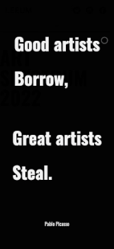

※실제 포트폴리오 링크는 글 최하단에 있습니다※

# NewLeeumSite

리움 웹사이트 프로젝트 (프론트엔드)

Thyssen-Bornemisza National Museum의 사이트 구조를 참고해서
리움 미술관의 웹사이트를 리모델링하는 프로젝트.

## Repo Contents

- plan : 분석 및 설계

  - analysis_Thyssen

- reference : 웹사이트 분석을 위한 자료 모음

  - ref_Leeum
    - overview
    - assets
  - ref_Thyssen
    - overview
    - assets

- site : 사이트
  - index.html
  - membership.html
  - ticket.html
  - js
  - css
  - assets

## Reference

- https://www.museothyssen.org/webdocs/conectathyssen/artistas-migrantes/en/#
- https://www.leeum.org/

---

# 리움미술관 홈페이지 리뉴얼

## 프로젝트 설명

## 개요

프론트엔드 개발자로서 기획과 아이디어를 짜는 것보다 아이디어를 구현하는 것과 성능을 최적화하는 데에, 그리고 사용성에 신경을 많이 써야한다고 생각했습니다.

해당 글에서는 위와 같은 생각이 어떻게 결과물에 적용되고 구현되었는지 살펴보겠습니다. 그리고 마지막에는 이 외에 신경써야 할 부분이 무엇이 있는지에 대해서도 알아보겠습니다.

- [제작시 중점사항](#제작시-중점사항)
  - [계획의 정확한 구현](#계획의-정확한-구현)
    - [철저한 와이어프레이밍을 통해 요구사항 정립](#철저한-와이어프레이밍)
    - [제작을 염두에 두고 Html 구조를 계획](#추후의-작업을-염두에-둔-html-설계)
  - [읽기 쉬운 코드](#읽기-쉬운-코드)
    - [코드 컨벤션 정립 후 최대한 이행](#컨벤션-정립-후-최대한-이행)
    - [DRY 원칙을 최대한 이행](<#DRY-(Don't-Repeat-Yourself)-원칙에-입각한-코드작성>)
    - ["클린코드"에 입각한 변수명 작성](#"클린코드"에-입각한-변수명-작성)
  - [사용성에 대한 고민](#사용성에-대한-고민)
    - [스크롤과 클릭 한번만 하면 되는 화면 구성](#스크롤과-클릭-한번만-하면-되는-화면-구성)
    - [미디어 쿼리를 통한 스크린의 다양화](#미디어-쿼리를-통한-스크린의-다양화)
    - [사용자를 생각하게 하지않는 디자인](#사용자를-생각하게-하지않는-디자인)
  - [나가며](#나가며)
    - [완벽한 코드는 없다](완벽한-코드는-없다)
      - [미디어 쿼리 작성시 반복된 코드의 사용 개선](미디어-쿼리-작성시-반복된-코드의-사용)
      - [자바스크립트 코드의 모듈화하여 서로 영향을 주지 않도록 하기](#자바스크립트-코드를-모듈화-해서-서로-영향받지-않게-하기)
      - [기능별로 코드를 "문단화"하여 정리하기](#읽기-쉽도록-코드를-"문단"으로-나누기)

## 제작시 중점사항

### 계획의 정확한 구현

조직은 각자가 자신의 할일을 정확히 수행할 때 유기적이고 효율적으로 운영됩니다. 그런 점에서 프론트엔드는 심미성이나 기획에 천착할 것이 아니라, 이미 기획되고 디자인된 요구사항을 확실히 이해하고 논의를 통하여 사전에 정립하여 이를 구현하는 데 최선을 다해야한다고 생각합니다. 이는 다음과 같은 구체적 방법을 통해 실질적으로 적용되었습니다.

1. 철저한 와이어프레이밍

   

   발사믹 목업3 툴을 사용하여 신속히 작업을 할 수 있었고, 아이디어와 디자인을 가시화시키는 과정에서 예상되는 문제점들을 발견하고 이를 미리 준비할 수 있었습니다. 예를 들어, 화면의 너비보다 더 긴 문장을 끊김없이 계속 흐르게 하려면, 문장을 세번이상 반복한 뒤, left값을 0->문장길이의 200%,다시 0 -> 문장길이의 200%로 이동시켜야 합니다. 대신, 화면이 가변하므로, 문장길이의 값이 하드코딩 되어선 안된다는 문제가 발견되었습니다. 따라서 다음과 같은 방안을 생각했습니다.

   1. JavaScript의 offsetWidth 메소드를 활용해 문장의 길이를 픽셀단위로 구한뒤
   2. JavaScript를 이용해 CSS의 :root에 --data-length라는 프로퍼티를 세팅하고 문장길이를 대입해 줍니다.

   이렇게 하면 화면 크기에 따라 상대단위폰트를 사용한 문장의 길이가 달라져도 전체 문장 길이를 알아낼 수 있고 이로써 정확하게 흐르는 문자 애니메이션을 만들 수 있었습니다.

2. 추후의 작업을 염두에 둔 html 설계

   앞서 말씀 드렸듯이 필요한 방안을 미리 고민하는 것 이외에도 추후 작업에 도움이 될 수 있는 작은 부분에도 신경을 썼습니다. 대표적으로 헤드, `body`, `footer`의 각 부분에 추가적인 div를 씌워 이중구조로 만들어 손쉽게 너비를 조작할 수 있게 하였습니다. 또한 처음 보는 사람도 쉽게 내용을 알 수 있도록 클래스명을 작성했습니다. 예를 들어 body하위에 button요소가 2개 있으며 버튼 요소에는 파란 버튼과 빨간 버튼이 있다고 가정하면 다음과 같이 작성합니다.

   ```html
   <body id="cont">
     <div class="cont ibx">
       <button class="cont__button-blue"></button>
       <button class="cont__button-red"></button>
     </div>
   </body>
   ```

### 읽기 쉬운 코드

실력이 많이 부족할 지라도, 시도하고 항상 발전을 꾀하는 것이 주니어의 필수 자질이라 생각합니다. 특히 읽기 쉬운 코드를 작성하려는 노력은 실력자들만의 전유물이 아니며 모두가 지향해야할 목표라는 생각에 이번 포트폴리오에서 어설프게나마 이를 적용하려고 노력했습니다.

1. 컨벤션 정립 후 최대한 이행

   백명의 프로그래머가 있다면 백가지의 코드 스타일이 있을 것입니다. 변수명을 짓는 것까지도 사전에 토의를 거치지 않으면 프랑켄슈타인 같은 코드가 탄생할 것입니다. 이를 방지하기 위해서, 비록 혼자 작업을 했지만 이런 상황을 가정하고 코드의 맨 윗 공간에 코드 컨벤션에 대한 설명을 삽입했습니다. 컨벤션을 이해하면 작성하기 쉬울 뿐만 아니라 읽기에도 도움이 될 것이라 생각하기 때문입니다.

   ```html
   <!-- 
     [ 명명원칙 ]
     1. 이중 박스
     2. 시맨틱 내용과 가장 근접하게 내용삽입. (div안에 시맨틱)
     3. 하위 구조는 상위 구조의 이름을 상속해서 명명한다. (.top .top__menu)
    -->
   <!-- body 시작 -->
   ```

2. DRY (Don't Repeat Yourself) 원칙에 입각한 코드작성

   코딩을 시작한지 얼마 되지 않았기 때문에 효율적인 코드 작성에는 아직 한계가 있습니다. 하지만 작동하는 코드를 만들고 나면 줄일 수 있는 부분이 있지 않은지 확인하는 과정을 거쳤습니다. CSS에서는 클래스를 통해서, 자바스크립트에서는 반복문을 통해 이를 적용했습니다.

   예는 다음과 같습니다. 티켓을 클릭하면 티켓카드의 색이 반전되는 기능인데, 티켓 색이 검정인지 아닌지를 불리언값으로 저장하는 변수를 배열로 만들어 코드 수를 줄였고, forEach를 사용해 반복되는 코드수를 절반으로 줄였습니다.

   ```js
   const tickets = document.querySelectorAll(".ticket");
   const textSelect = document.querySelectorAll(".selectBtn span");
   const infoTicket = document.querySelector(".infoTicket > span");

   console.log(`tickets`, tickets);

   let num = 0;
   let isBlack = [false, false];

   tickets.forEach((ele, idx) => {
     tickets[idx].addEventListener("click", () => {
       if (!isBlack[idx]) {
         tickets[idx].classList.add("on");
         textSelect[idx].innerText = "취소";
         num++;
         isBlack[idx] = true;
       } else {
         tickets[idx].classList.remove("on");
         textSelect[idx].innerText = "선택";
         num--;
         isBlack[idx] = false;
       }
       if (num !== 0) {
         infoTicket.innerText = `${num}개의 전시를 선택했습니다.`;
       } else {
         infoTicket.innerText = "관람을 원하는 전시를 선택해주세요";
       }
     });
   });
   ```

3. "클린코드"에 입각한 변수명 작성

   줄임말을 사용해서 변수명을 작성하는 것을 많이 보았습니다. 하지만 작업 전에 훑어본 "클린코드"라는 책에서 설명하는 변수명 방식이 개인적으로는 훨씬 합리적이라는 생각이 들어서 이를 적용해 보았습니다.

   간단히 말해, 함수의 변수명은 영어 동사로 작성하고 `function turnCard(){}`

   if문에서의 불리언 값 역할을 하는 변수는 is로 시작하는 의문사로 작성했으며 `let isBlack = []`

   배열은 복수의 명사로 작성하는 식입니다. `const tickets = [ticket1, ticket2]`

   이를 통해 일상의 언어활동을 통해 얻어진 common sense만으로도 변수명과 코드의 흐름이 읽히도록 노력했습니다.

### 사용성에 대한 고민

프론트엔드는 프로젝트의 사용자를 연결하는 접점입니다. 제공하는 서비스가 아무리 좋더라도 이를 조작하는 부분이 불편하다면 사용자는 실망하고 더 이상 이용을 하지 않게 됩니다. 이는 팀원들과 회사에 누가 되는 일이며, 때문에 프론트엔드 개발자는 막중한 책임감을 지녀야 한다고 생각합니다.

따라서 프로젝트를 시작하기 전에 "사용자를 생각하게 하지마"라는 책을 읽었고, 여기서 소개된 몇가지 사용성 원칙을 해당 프로젝트에 적용할 수 있도록 했습니다.

1. 스크롤과 클릭 한번만 하면 되는 화면 구성

   스크롤을 하기만 하면 사이트의 전체 모습을 볼 수 있게 해놓았습니다. 또한 좌측 하단에 바로 티켓구매를 위한 버튼을 위치해 두어서 스크롤을 하다가 바로 티켓구매로 넘어갈 수 있도록 했습니다.

   특히 중간에 가로 스크롤을 통한 작품갤러리 섹션에서도 가로방향으로 진행하기 위해 특별한 조작이 필요없이 하던 스크롤을 계속하면 스크롤의 방향이 가로방향으로 바뀌고, 갤러리의 끝에 다다르면 다음 섹션으로 넘어가며 스크롤 방향이 원상 복귀되도록 하였습니다.


2. 미디어 쿼리를 통한 스크린의 다양화

사용자가 어떤 스크린 환경에서 접속하더라도 최대한 비슷한 경험을 하도록 하고 싶었습니다. 600픽셀, 992픽셀 부분에서 미디어 쿼리를 통해 화면의 구성이 조금씩 달라집니다.

예를 들어 **스마트폰 환경**에서는 티켓 구매버튼에서 텍스트가 사라지고 직관적인 티켓그림으로 바뀌며 버튼의 크기가 작아지고 클릭하기 쉽도록 오른쪽으로 이동합니다. 또한 글로벌 메뉴부분을 드롭다운 형식으로 바꾸었고, 기존의 검색 버튼을 삭제하고 드롭다운 메뉴 상단으로 옮겼습니다.



**태블릿 환경**에서는 글로벌 메뉴가 양쪽정렬로 바뀌게 되며 마우스 호버오버 효과가 있던 ''작가'' 섹션을 flex의 order기능을 활용해 사진-이름 순으로 배치한뒤 애니메이션으로 기존의 마우스 호버오버 효과를 대체했습니다.


기존의 마우스 스크롤 기능을 사용할 수 없고, 마우스 커서가 변화해 직관적으로 클릭가능한 부분을 보여주는 기능이 사라졌기 때문에 곳곳에 추가적인 설명을 넣었습니다.


마지막으로 일반적인 모니터 화면에서는 섹션별로 마우스 커서를 변화시켜 작동방법이 달라지거나 혹은 새로운 기능이 있음을 암시할 수 있게 했습니다. 또한 QHD 환경이 늘어나는 추세를 염두에 두고, QHD화면에서도 기존화면에서 느낄 수 있는 볼드한 디자인을 살릴 수 있도록 폰트에 상대 단위를 사용했습니다. 그래서 큰화면에서도 화면을 가득 채우는 강렬함을 느낄 수 있습니다.

3. 사용자를 생각하게 하지않는 디자인

무엇보다 "사용자를 생각하게 하지마"라는 사용성에 관한 책을 읽고 여기서 언급되는 원칙들을 가장 많이 적용한 부분은 티켓 구매 페이지입니다.

1. 사용자는 읽지 않고 훑어본다.

   선택이라고 쓰여진 클릭 버튼이 있지만, 카드를 클릭하는 사용자를 위해서 카드전체에 이벤트리스너를 넣었습니다.

2. 사용자는 작동방식을 이해하려 하지 않는다.

   관람을 원하시는 전시를 클릭하라는 정보가 있지만, 읽지 않는 것이 우리의 습성입니다. 따라서 그냥 클릭을 하게 되면 클릭되었음을 알릴 수 있도록 카드의 색이 반전되며, 동시에 1개의 전시가 클릭되었다는 말이 예매하기 버튼 밑에 등장하게 됩니다. 카드를 2개 클릭하면 2개의 전시가 클릭되었음을 알려줍니다.

   

## 나가며

### 완벽한 코드는 없다

그 누구도 한붓그리기를 하듯이 한번에 완벽한 코드를 짤 수는 없다고 생각합니다. 끊임없이 코드를 재작성하면서 "방망이 깎는 노인" 과 같은 프로페셔널리즘을 함양해야 하는 것은 모든 코더들의 기본 수칙일 것입니다. 저는 이 프로젝트가 아직 미완성되었다고 느끼며, 계속해서 수정을 가할 생각입니다. 응당 그러하는 것이 코딩이라 생각하며, 저 자신을 위해서도 큰 공부가 된다고 느끼기 때문입니다. 현재 고쳐야 할 점은 다음과 같다고 사료됩니다.

1. 미디어 쿼리 작성시 반복된 코드의 사용

   급하게 작성한 부분, 이리저리 고민했던 부분은 정리가 잘 되지 않았기 때문에 중복된 코드가 많이 남아있습니다. 이를 정리하고 성능에 해가 될 만한 부분을 없애야 합니다.

2. 자바스크립트 코드를 모듈화 해서 서로 영향받지 않게 하기

   미디어쿼리를 작성하다보니 설계시 생각치 못한 부분이 있어 이를 급히 수정했습니다. 바로 검색창을 없애고 드롭다운 메뉴 안으로 삽입하는 부분인데, 이를 구현하기 위해 자바스크립트를 사용했고, 이 부분에서 모바일용, 데스크탑용 코드가 나뉘어 지면서 서로 영향을 받는 부분이 생겼습니다. 현재는 해결되었지만 다시한번 코드를 보면서 문제를 확인해야합니다.

3. 읽기 쉽도록 코드를 "문단"으로 나누기

   선언부와 함수부를 따로 모아서 나누고, 기능 별로 줄바꿈을 해서 마치 글에서 "문단"을 나누듯 코드를 나누어 가독성을 향상시켜야 합니다.

읽어주셔서 감사합니다.

실제 사이트는 다음의 링크에서 보실 수 있습니다.

http://oulico.dothome.co.kr/
